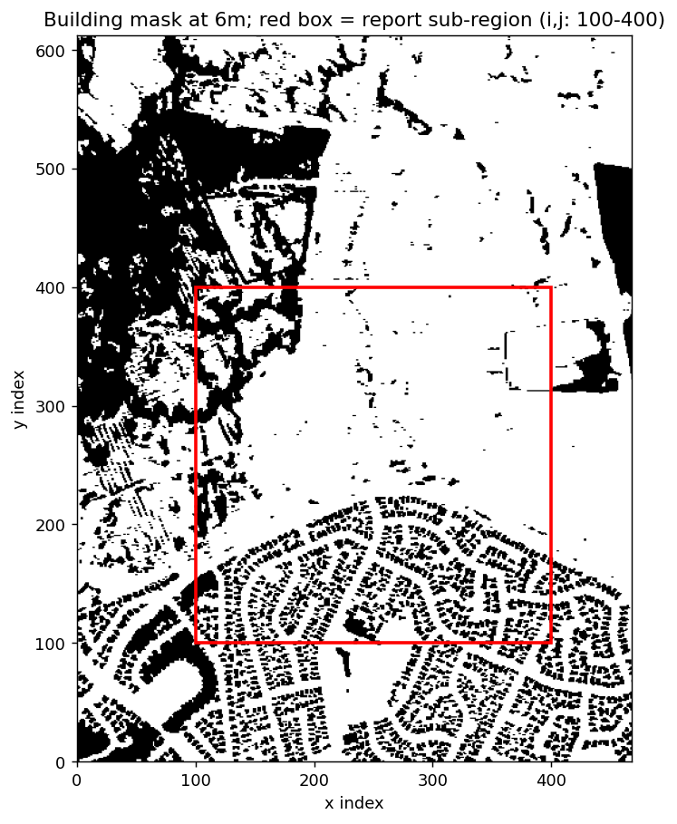
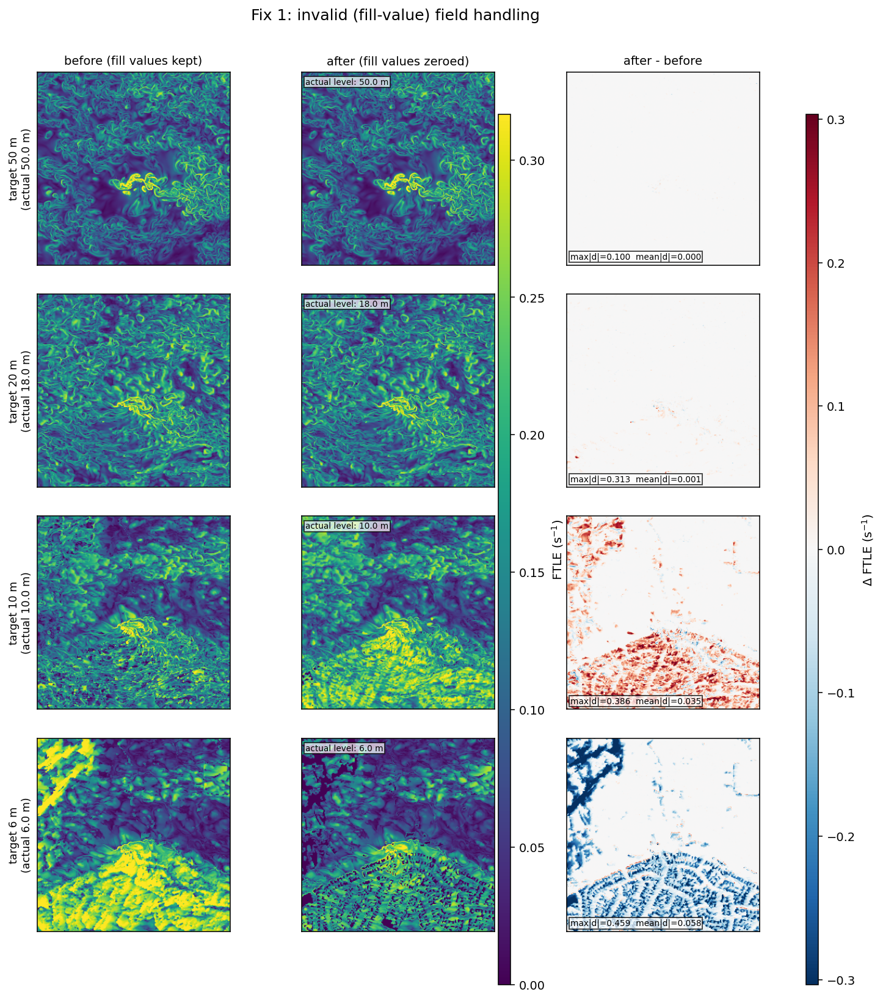
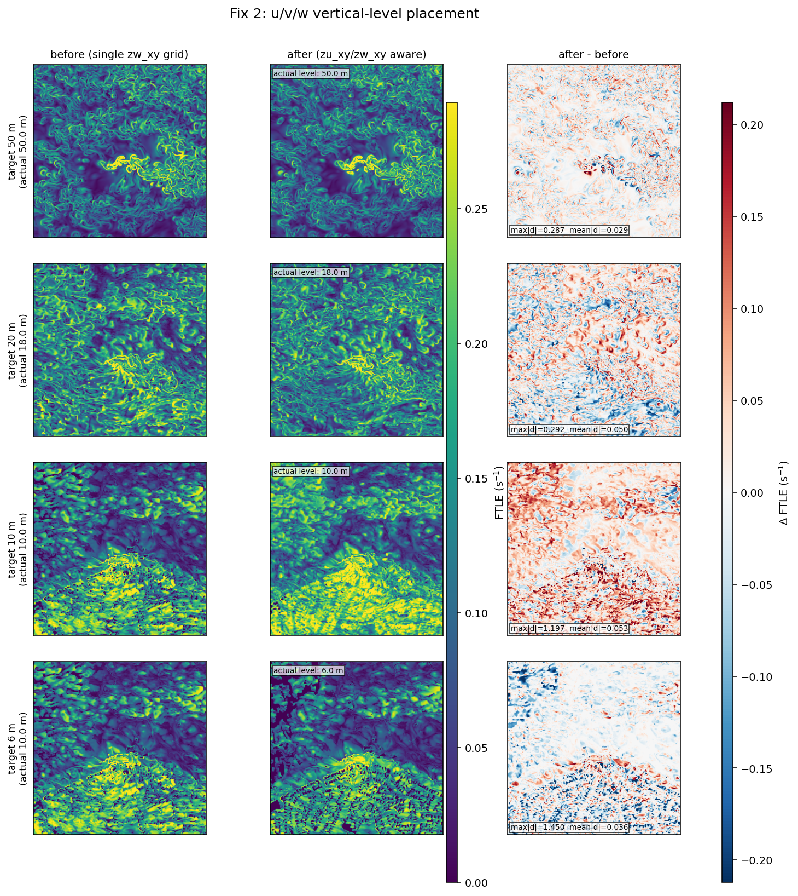
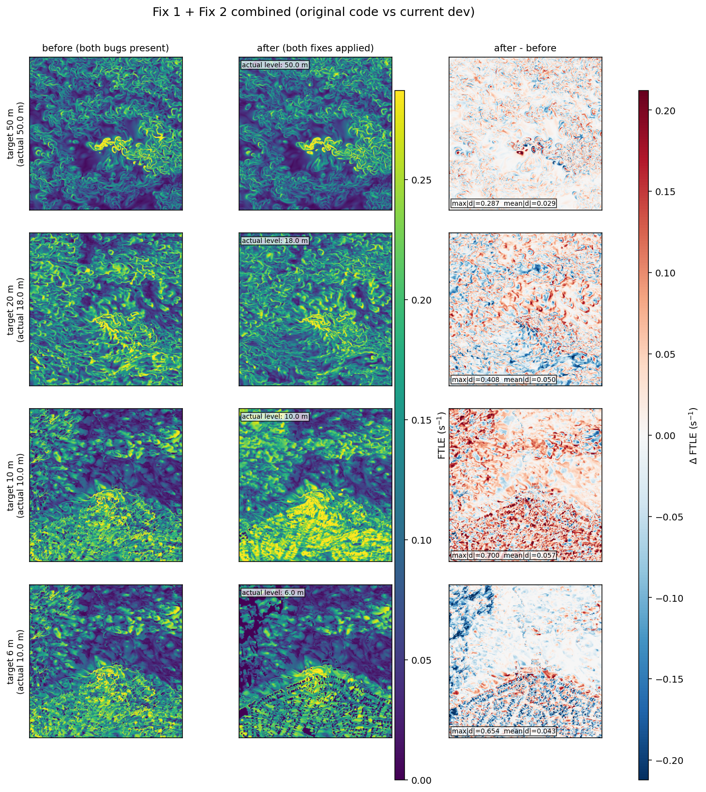

# PALM-FTLE: effect of the June 2026 correctness fixes

**Repo:** `pv_ftle` (branch `dev`, HEAD `6172ce1`)
**Data:** `small_blf_day_loc1_4m_xy_N04.003.nc` (PALM LES, 4 m horizontal resolution, test file shipped in `testdata/README.md`)
**Solver:** `palm_ftle_idx` (C++ RK4 integrator, index-space cell lookup)

## Summary

Between 2026-06-21 and 2026-06-26 two independent correctness bugs were fixed in the
PALM branch of the FTLE pipeline:

1. **Invalid field values not handled correctly** — PALM marks building/obstacle
   cells with a fill value (`-9999`) rather than physical velocity. Before the fix
   this fill value was read straight into the velocity arrays used for particle
   advection; after the fix (`zero_fill=True`, the physically correct choice
   since solid cells have zero velocity) it is replaced with 0.
2. **u, v, w placed on the wrong vertical levels** — PALM stores `u`/`v` on the
   cell-centre axis `zu_xy` and `w` on the face axis `zw_xy`, offset by half a
   grid cell, with the bottom `w` face frequently missing from the file
   altogether. Before the fix a single (`w`'s) `z` axis was used for the whole
   velocity field and the missing bottom face was never reconstructed, which
   left the lowest cell-centre level (nominally 6 m) either absent or
   mislabelled ("black-spot" problem).

Both bugs are shown below to matter almost entirely **at/below roof height**
(here ≤ 10 m) and to be **negligible in the open flow above the buildings**
(20–50 m), which is exactly where the two bugs are physically expected to
bite: masked cells only exist inside/around buildings, and the bottom-face
vertical-grid error only affects the lowest one or two model levels.

## Region used for the comparison

FTLE was computed backward in time (`--tintegr -10 s`, `--time-index 20`,
non-frozen/time-evolving velocity, default CFL 0.25) over index sub-window
`i=[100,400]`, `j=[100,400]` (a 1200 m × 1200 m tile), chosen to straddle a
dense residential block (south), a coastal building cluster (west) and open
water with no buildings (centre/east) — see the red box below.



## Method

Re-running the exact pre-fix commits was avoided because many unrelated
changes landed in the same week (switch to the `ftlecpp` C++ integrator,
time-dependent velocity, CFL step-count logic, coastlines, …). Diffing across
those commits would confound "what changed" with "which fix mattered". Instead,
[`scripts/ftle_variants.py`](../scripts/ftle_variants.py) reproduces
`PalmFtleIdx.compute()` from the current `dev` tip with two independent
boolean toggles patched back in at exactly the lines the historical commits
touched:

* `zero_fill` — passed straight to `UVWPalmReader` (`True` = current/fixed
  behaviour, `False` = pre-fix, matching the `--no-zero-fill` CLI flag added in
  commit `d36d87d`).
* `extend_bottom` — controls whether the missing `zw_xy` bottom face is
  reconstructed from `zu_xy` before building the integration grid (`True` =
  current/fixed behaviour from commits `030b3aa` / `070d947`, `False` =
  pre-fix, a single unmodified `zw_xy` axis for everything).

Three cases were computed with everything else (grid, region, time window,
integrator, CFL) held fixed, via
[`scripts/run_report_cases.py`](../scripts/run_report_cases.py):

| case               | zero_fill | extend_bottom | role                                   |
|---------------------|:---------:|:--------------:|-----------------------------------------|
| `after`             | True      | True           | current/fixed (reference for both fixes) |
| `before_zero_fill`  | False     | True           | pre-fix invalid-field-value handling     |
| `before_vertical`   | True      | False          | pre-fix vertical-level placement         |
| `before_both`       | False     | False          | original code, both bugs present         |

A fourth case, `before_both` (`zero_fill=False`, `extend_bottom=False`), reproduces
the original, unpatched code path with both bugs present simultaneously, for a
direct "original vs current" comparison in addition to the two single-fix
comparisons. Each fix is isolated by comparing `after` against the one
`before_*` case that differs from it in a single flag. Figures and per-level
statistics were then produced by
[`scripts/make_report_figures.py`](../scripts/make_report_figures.py).

For each requested nominal height (50, 20, 10, 6 m) the nearest available
cell-centre level is used in each case's own vertical grid — the two grids are
not always identical, which is itself part of what the vertical-level fix
report documents (see below).

## Fix 1 — invalid (fill-value) field handling

**Commits:** `5970bbe` (2026-06-22, introduces masked-array handling in
`UVWPalmReader`), `d36d87d` (2026-06-22, " --no-zero-fill to recover
old/wrong results" — makes `zero_fill=True` the default and adds the escape
hatch), `030b3aa` (2026-06-24, `palm_ftle_idx` starts using `UVWPalmReader`
with `zero_fill=True` hard-coded).

PALM writes `-9999` (or a large sentinel) for `u`, `v`, `w` inside solid
(building/terrain) cells. `UVWPalmReader._to_float32()`:

```python
# src/pv_ftle/uvw_palm_reader.py  (current / after)
if zero_fill and hasattr(arr, 'filled'):
    # netCDF4 masked arrays: fill masked cells with 0
    arr = arr.filled(0.0)
return np.array(np.nan_to_num(arr, nan=0.0), dtype=np.float32)
```

Before the fix, `zero_fill` did not exist and the masked fill value was left
in place, so a solid cell reported a velocity of `-9999 m/s` instead of `0`.
That single sentinel is enough to corrupt any interpolation stencil that
touches a building cell, and also poisons the CFL step-count estimate that
sizes the RK4 integration:

```
before_zero_fill:  max_speed=1000.00 m/s  (clipped)   nsteps=10001
after:              max_speed=  49.06 m/s              nsteps=  491
```

(`max_speed` is clipped at 1000 m/s in the driver purely so the run
terminates; the raw value implied by an un-zeroed `-9999` cell is far higher.)



| target height | actual level (both cases) | max\|Δ\| | mean\|Δ\| | rms   | max FTLE before | max FTLE after |
|---:|---:|---:|---:|---:|---:|---:|
| 50 m | 50.0 m | 0.100 | 0.0004 | 0.0013 | 0.395 | 0.395 |
| 20 m | 18.0 m | 0.313 | 0.0012 | 0.0059 | 0.393 | 0.391 |
| 10 m | 10.0 m | 0.386 | 0.0352 | 0.0705 | 0.399 | 0.399 |
|  6 m |  6.0 m | 0.459 | 0.0582 | 0.1105 | 0.459 | 0.403 |

**Reading the figure:** at 50 m and 20 m — well above the buildings — the
before/after columns and the difference panel are visually identical (mean
|Δ| ≤ 0.001); these levels never touch a masked cell within the 10 s
integration window, so the fix has (correctly) no effect there. At 10 m and
especially 6 m the "before" panel shows the entire residential block and the
western building cluster washed out to a near-uniform high-FTLE plateau —
individual buildings are no longer distinguishable — because trajectories
that pass near/through a building cell pick up the `-9999` sentinel and are
flung out of the domain, registering as spurious high stretching over a wide
area. The "after" panel instead resolves per-building wakes and leaves the
open water (top-right) essentially untouched, which is the physically
expected picture.

## Fix 2 — u, v, w vertical-level placement

**Commits:** `030b3aa` (2026-06-24, "now palm_ftle_idx uses UVWPalmReader" —
introduces `getUVZAxis()` / `zu_xy` awareness), `070d947` (2026-06-24, "fixed
the black spot problem by properly extending the z axis down to 4 m").

PALM's Arakawa C-grid stores `u`, `v` at cell centres (`zu_xy`) and `w` at
cell faces (`zw_xy`), offset by half a grid spacing, and the file often omits
the lowest `w` face. In this test file:

```
zu_xy (u, v):  6  10  14  18  22  26  30  34  38  42  46  50  54  62  70 …
zw_xy (w):        8  12  16  20  24  28  32  36  40  44  48  52  56  64 …
```

`zw_xy[0] = 8 m` sits *above* `zu_xy[0] = 6 m`, i.e. the bottom face needed to
bracket the lowest `u`/`v` level is missing from the file. The fix
reconstructs it by reflection and prepends a zero-velocity (no-penetration)
slice:

```python
# src/pv_ftle/palm_ftle_idx.py  (current / after)
if zaxis[0] > zuaxis[0]:
    z_bottom = 2.0 * float(zuaxis[0]) - float(zaxis[0])   # = 4 m here
    zaxis = np.concatenate([[z_bottom], zaxis])
    wface  = np.concatenate([np.zeros_like(wface[:, :1]), wface], axis=1)
```

This is not cosmetic: the FTLE output levels are the *cell centres* of the
`zaxis` corner grid, and extending `zaxis` down to 4 m makes those cell
centres land exactly on `zu_xy` (6, 10, 14, … m). Without the fix, the cell
centres of the unmodified `zw_xy` grid are 10, 14, 18, … m — **the 6 m level
does not exist at all**, and a caller asking for "level 0" silently gets 10 m
data instead ("black-spot" problem: the lowest requested level is either
missing or silently mislabelled).

| case (grid)              | # levels | cell-centre heights (m)                              |
|--------------------------|:--------:|-------------------------------------------------------|
| `before` (raw `zw_xy`)   | 17       | 10, 14, 18, 22, 26, 30, 34, 38, 42, 46, 50, 54, 60, 68, 76, 84, 92 |
| `after` (extended)       | 18       | 6, 10, 14, 18, 22, 26, 30, 34, 38, 42, 46, 50, 54, 60, 68, 76, 84, 92 |



| target height | before: idx / actual z | after: idx / actual z | max\|Δ\| | mean\|Δ\| | max FTLE before | max FTLE after |
|---:|---:|---:|---:|---:|---:|---:|
| 50 m | 10 / 50.0 m | 11 / 50.0 m | 0.287 | 0.029 | 0.386 | 0.395 |
| 20 m |  2 / 18.0 m |  3 / 18.0 m | 0.292 | 0.050 | 0.405 | 0.391 |
| 10 m |  0 / 10.0 m |  1 / 10.0 m | 1.197 | 0.053 | 1.464 | 0.399 |
|  6 m |  **0 / 10.0 m (6 m does not exist)** |  0 / 6.0 m | 1.450 | 0.036 | 1.464 | 0.403 |

**Reading the figure and table:** for the 6 m row, the "before" column is
*identical* to the "before" 10 m row — because that is genuinely the nearest
level the unfixed code can produce; there is no 6 m data before the fix. For
10 m, both grids happen to contain the same nominal height, so this is an
apples-to-apples comparison at fixed height, isolating the effect of the
missing-face reconstruction on the RK4 trajectories: `max|Δ| ≈ 1.2`, an
order of magnitude larger than anything seen for Fix 1, and the pre-fix
maximum FTLE (1.46) is roughly 3.7× the physically expected value — an
artefact of the ground-truncated domain letting near-surface trajectories
"fall through" the missing bottom boundary instead of reflecting off it.
Even at 50 m — well above roof height and thus not expected to depend on the
near-ground boundary condition to first order — the fix still produces a
non-trivial mean difference (0.029, larger than Fix 1's 0.0004 at the same
height). This is because RK4 trajectories are integrated backward for the
full 10 s window in 3-D: any parcel whose backward path dips toward the
surface anywhere in the domain samples the (correct or incorrect) bottom
boundary, so the effect of the fix is not perfectly confined to the lowest
level, unlike Fix 1 which only affects cells that are themselves masked.

## Combined effect of both fixes (original code vs current `dev`)

This comparison runs `before_both` (`zero_fill=False`, `extend_bottom=False` —
both bugs present, i.e. the actual original code path) directly against
`after` (both fixes applied), rather than isolating one fix at a time.



| target height | before: idx / actual z | after: idx / actual z | max\|Δ\| | mean\|Δ\| | max FTLE before | max FTLE after |
|---:|---:|---:|---:|---:|---:|---:|
| 50 m | 10 / 50.0 m | 11 / 50.0 m | 0.287 | 0.029 | 0.395 | 0.395 |
| 20 m |  2 / 18.0 m |  3 / 18.0 m | 0.408 | 0.050 | 0.406 | 0.391 |
| 10 m |  0 / 10.0 m |  1 / 10.0 m | 0.700 | 0.057 | 0.523 | 0.399 |
|  6 m |  **0 / 10.0 m (6 m does not exist)** |  0 / 6.0 m | 0.654 | 0.043 | 0.523 | 0.403 |

**Reading the figure and table:** at 50 m and 20 m the combined comparison is
essentially indistinguishable from the Fix-2-only comparison above (same
max/mean |Δ| to 2–3 significant figures) — with both bugs present, the
fill-value bug still contributes nothing that high up, so the vertical-level
bug alone accounts for the difference. At 10 m and 6 m the picture is more
interesting: the pre-fix **maximum** FTLE with *both* bugs present (0.52) is
lower than with *either* bug in isolation (1.46 for the vertical bug alone,
0.46 for the fill-value bug alone). This is not a cancellation in any
physical sense — it is because the two bugs corrupt the same near-surface
velocity field in different, path-dependent ways, and RK4 trajectories that
would otherwise loop through the single worst-case artefact of one bug take
a different (still wrong, but numerically less extreme) route once the other
bug's corruption is also present. In other words, **the size of either bug's
error is not a reliable estimate of the other's, and the two must be fixed
together** — the combined "before" field is still qualitatively wrong (compare
the washed-out residential block at 10 m/6 m to the sharply resolved building
wakes in "after"), just not by simply adding the two single-fix error maps.

## Practical takeaways

* Both fixes matter almost exclusively **near the surface / near buildings**
  (≤ 10 m here); FTLE fields at 20–50 m are essentially unaffected by either
  bug in this dataset, so historical results computed above roof height with
  the old code are likely still trustworthy.
* The invalid-field-value bug (Fix 1) is the more visually dramatic of the
  two at 6 m: it washes out individual building wakes into a near-uniform
  high-FTLE plateau across an entire residential block, and also silently
  inflates the CFL-based step count by ~20× (491 → 10001 RK4 sub-steps) via
  the corrupted max-speed estimate.
* The vertical-level bug (Fix 2) is more subtle but arguably more serious:
  before the fix, requesting the lowest PALM output level did not raise an
  error — it silently returned data for the *wrong physical height* (10 m
  instead of 6 m), and even "matching" heights (10 m, 50 m) differ from the
  fixed result because the whole column's backward trajectories are coupled
  through the (correct or truncated) domain floor.
* Neither bug is specific to this test file: any PALM run with masked
  building cells and/or a `zw_xy` axis that starts above `zu_xy[0]` (the
  normal PALM convention) will exhibit both.
* The two bugs interact rather than simply adding: the worst-case FTLE value
  with both present (0.52) is smaller than with either alone (1.46 and 0.46
  respectively), so partially fixing only one of the two historical bugs is
  not a reliable way to bound the remaining error — see "Combined effect"
  above.

## Reproducing this report

```bash
source venv/bin/activate
# one-off: build the C++ RK4 extension into src/pv_ftle/ if not already built
cmake -S cpp -B build_manual -DCMAKE_BUILD_TYPE=Release && cmake --build build_manual && cmake --install build_manual

python scripts/run_report_cases.py       # ~11 minutes; writes report/data/*.npz (4 cases)
python scripts/make_report_figures.py    # writes report/figures/compare_*.png + stats.txt
```
